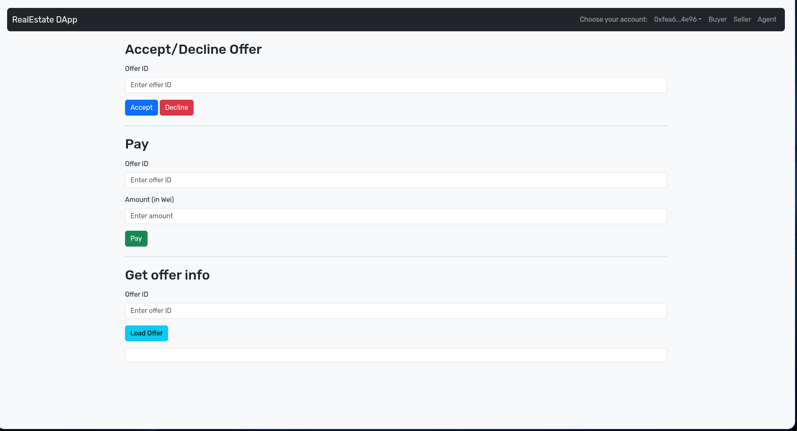
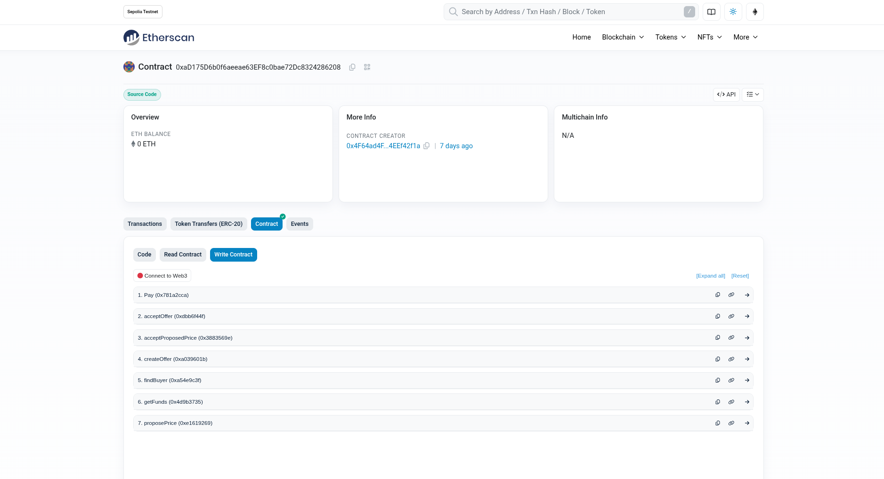

# Smart Contract and Decentralized Application

This project contains a fully working **Ethereum smart contract with business logic**, connected to a **frontend decentralized application (DApp)**.  
The system was successfully **tested on a local Ethereum testnet using Truffle**, and later **deployed to the Ethereum Sepolia testnet**.

The repository includes the smart contract implementation, a simple web interface to interact with it, and the business workflow for a real estate transaction process.

## Business Logic

There are 3 parties involved: **Seller, Real Estate Agent, and Buyer**.

- **Seller** – creates a sale offer and accepts or rejects the price proposed by the agent  
- **Agent** – evaluates the property, sends the price to the seller, finds a buyer, and offers the property to them  
- **Buyer** – accepts or rejects the offer and makes the payment  

If the buyer accepts the offer:
- The **Seller receives the payment**
- The **Agent receives a commission for the service**
- The **Buyer receives the property**

If the buyer rejects the offer:
- The buyer is rejected
- The agent must search for a new buyer.

#### The smart contract uses the "Pull over Push" pattern

When the buyer transfers the funds, the smart contract **does not automatically send them to the seller and agent**.  
Instead, the seller and agent must **withdraw their funds themselves** using the `getFunds` method.

## Smart Contract

The smart contract is written in **Solidity**.  
The complete implementation can be found in the **contracts** directory.

## Front End

A simple frontend built using **Bootstrap** and **web3.js**.  
It allows users to interact with all functions of the smart contract.

## Smart Contract Deployment

The smart contract was deployed to the **Ethereum Sepolia test network**.

https://sepolia.etherscan.io/address/0xaD175D6b0f6aeeae63EF8c0bae72Dc8324286208#writeContract

